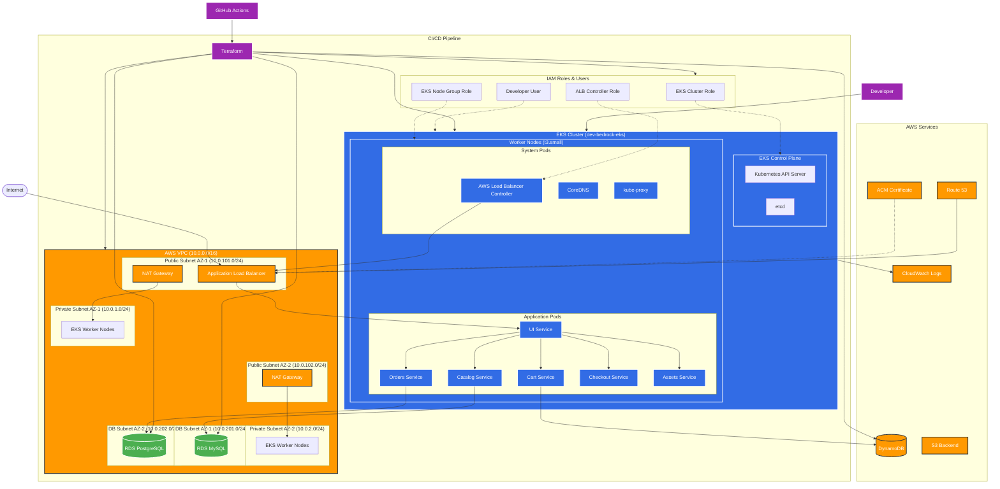

# Project Bedrock - EKS Retail Store Deployment

> **Assignment Solution**: Complete retail-store-sample-app deployment on AWS EKS with cost optimization

## Prerequisites

- AWS CLI configured
- GitHub repository with environment variables set

## GitHub Environment Setup

### Required Variables:
```
AWS_REGION = eu-west-1
ENVIRONMENT = dev
TF_STATE_BUCKET = your-unique-bucket-name
TF_STATE_KEY = bedrock/terraform.tfstate
CLUSTER_NAME = dev-bedrock-eks
```

### Required Secrets:
```
AWS_ACCESS_KEY_ID = your-aws-access-key
AWS_SECRET_ACCESS_KEY = your-aws-secret-key
```

### Optional:
```
DOMAIN_NAME = your-domain.com
ENABLE_INGRESS = true
```

## Architecture



### Infrastructure Components

- **VPC**: Multi-AZ setup with public/private subnets across 2 availability zones
- **EKS**: Kubernetes 1.28 cluster with t3.small worker nodes (cost-optimized)
- **RDS**: MySQL (catalog) + PostgreSQL (orders) with db.t3.micro instances
- **DynamoDB**: NoSQL database for cart service
- **ALB**: Application Load Balancer with SSL/TLS termination
- **IAM**: Granular roles for cluster, nodes, and read-only developer access
- **Route 53**: DNS management (optional)
- **ACM**: SSL certificate management (optional)

## Manual Deployment

```bash
# 1. Clone and setup
git clone <repo-url>
cd project-bedrock

# 2. Configure AWS
aws configure

# 3. Deploy infrastructure
cd terraform
terraform init
terraform apply

# 4. Deploy application
aws eks update-kubeconfig --region eu-west-1 --name dev-bedrock-eks
kubectl apply -f https://github.com/aws-containers/retail-store-sample-app/releases/latest/download/kubernetes.yaml

# 5. Check status
kubectl get pods
kubectl get svc ui
```

## Access Information

### Application Access:
```bash
# Get application URL
kubectl get svc ui

# Port forward for local access
kubectl port-forward svc/ui 8080:80
# Then visit: http://localhost:8080
```

### Developer Access:
```bash
# Configure read-only access
aws configure set aws_access_key_id $(terraform output -raw developer_access_key_id)
aws configure set aws_secret_access_key $(terraform output -raw developer_secret_access_key)
aws eks update-kubeconfig --region eu-west-1 --name dev-bedrock-eks

# Available commands for developers
kubectl get pods
kubectl get svc
kubectl logs -f deployment/ui
kubectl describe pod <pod-name>
```

## Assignment Requirements Met

### Core Requirements
- [x] Infrastructure as Code (Terraform)
- [x] VPC with public/private subnets
- [x] EKS cluster with IAM roles
- [x] Retail store application deployed
- [x] Read-only developer IAM user
- [x] CI/CD pipeline with GitHub Actions

### Bonus Features 
- [x] Managed databases (RDS MySQL/PostgreSQL, DynamoDB)
- [x] AWS Load Balancer Controller
- [x] SSL/TLS with ACM (when domain provided)
- [x] Route 53 integration (when domain provided)
- [x] Kubernetes Ingress for advanced routing

## 🚀 Current Workflow

### Automated Deployment
1. **Setup**: Configure GitHub environment variables and secrets (see above)
2. **Trigger**: Push to `main` branch
3. **Pipeline**: GitHub Actions automatically:
   - Plans and applies Terraform infrastructure
   - Deploys EKS cluster with all modules (VPC, IAM, RDS)
   - Installs AWS Load Balancer Controller (if enabled)
   - Deploys retail store application from upstream
   - Sets up Ingress (if enabled)
4. **Access**: Get application URL from `kubectl get svc ui` or Load Balancer

### Pipeline Stages
- **terraform-plan.yml**: Validates Terraform on PRs
- **terraform-apply.yml**: Deploys infrastructure and application on main branch

## Troubleshooting

```bash
# Check infrastructure status
terraform show

# Check application status
kubectl get all
kubectl get events --sort-by='.lastTimestamp'

# Check specific service
kubectl logs -f deployment/catalog
kubectl describe pod -l app=ui
```

## Project Structure

```
project-bedrock/
terraform/           # Infrastructure as Code
modules/        # Reusable Terraform modules
terraform.tfvars # Configuration variables
.github/workflows/  # CI/CD pipelines
k8s-manifests/     # Kubernetes configurations
scripts/           # Deployment scripts
```

---

**Current Implementation Status**:
- ✅ Terraform modules: VPC, EKS, IAM, RDS
- ✅ GitHub Actions: terraform-plan.yml, terraform-apply.yml
- ✅ Kubernetes: Ingress configurations
- ✅ Scripts: Environment setup and kubectl configuration

**Estimated deployment time**: 15 minutes